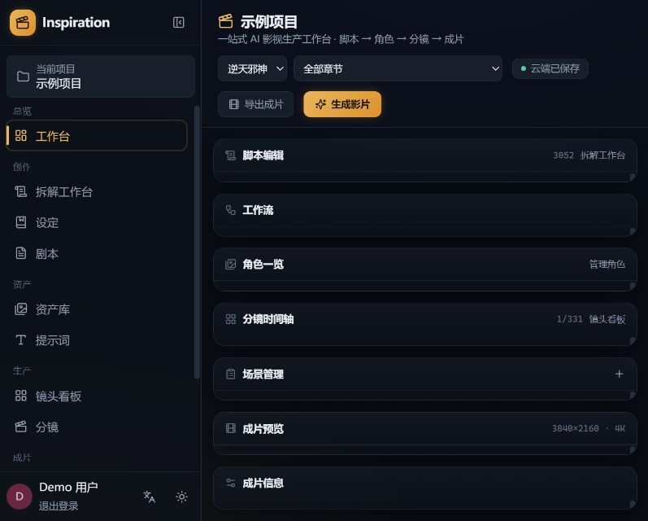
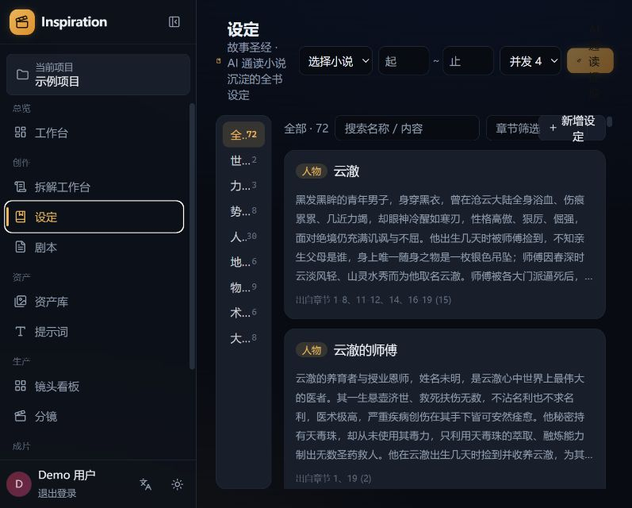
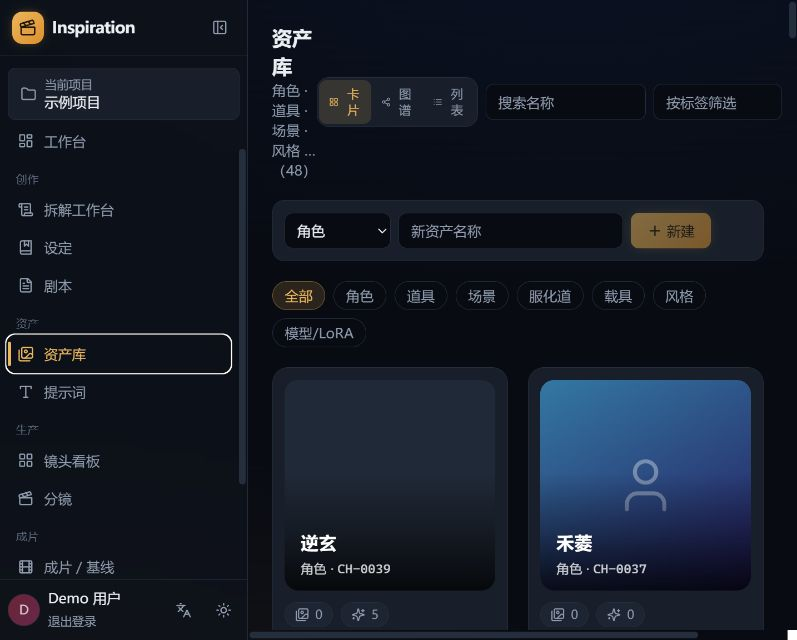
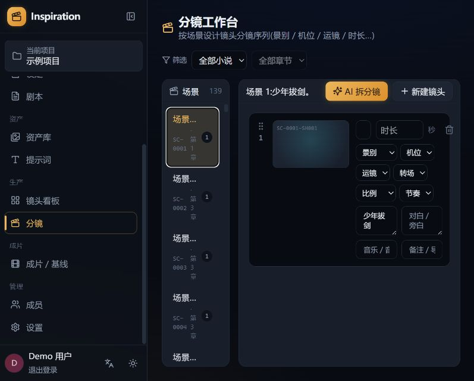
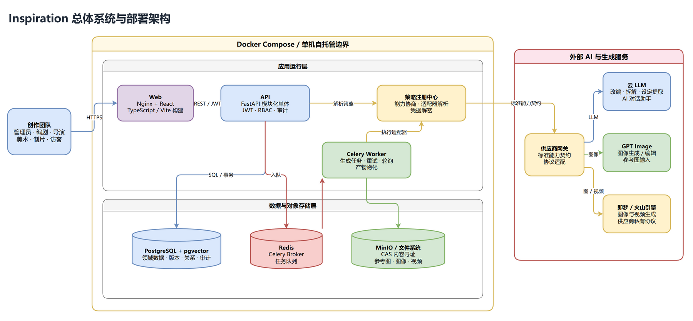
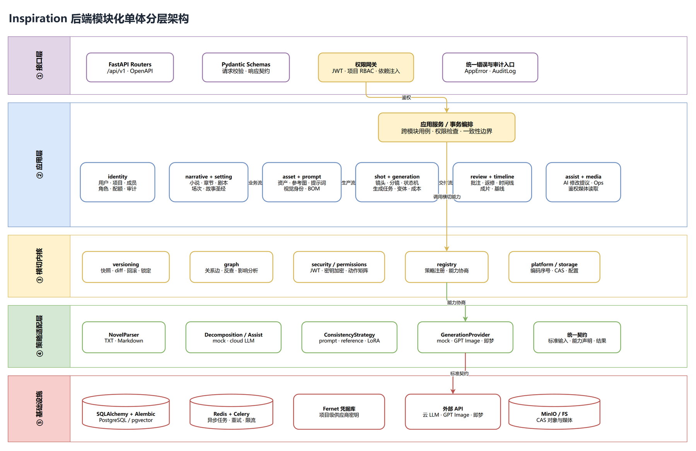
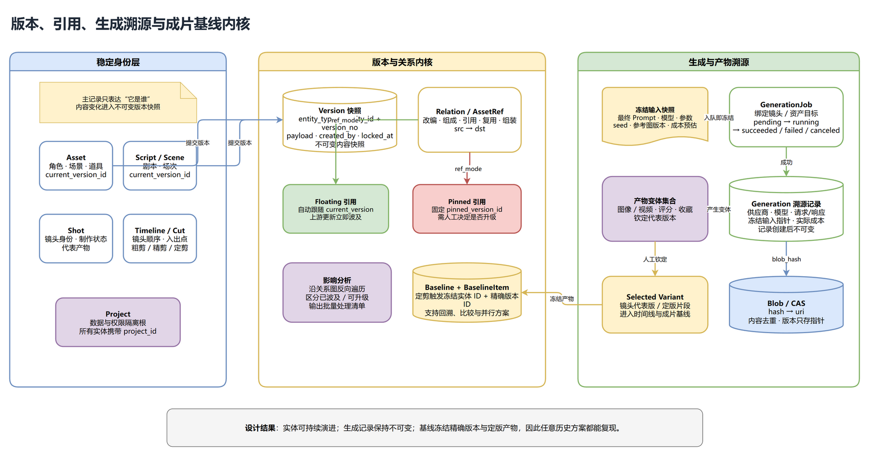

# Inspiration

> 面向影视、动漫与短片创作的 AIGC 资产管理与生产平台。

Inspiration 尝试把制造业中的**资产管理**与**配置管理**方法引入内容生产：将小说、设定、剧本、场次、镜头、角色、场景、提示词和生成结果都变成可管理、可复用、可追溯的生产资产，贯通从一段文字到成片基线的完整流程。

**FastAPI · React · TypeScript · PostgreSQL/pgvector · Redis/Celery · MinIO · Docker Compose**

> 当前状态：V1 全流程原型已完成，适合本地体验、产品演示和二次开发。默认使用 mock AI/生成策略；接入真实云模型前请先阅读[当前边界](#当前边界)。

## 为什么做 Inspiration

AIGC 降低了单次内容生成的成本，却放大了制作管理的问题：

- 同一个角色在不同镜头里容易“变脸”，风格也难以保持统一；
- 提示词、参考图、模型参数散落在聊天记录和文件夹中，无法可靠复用；
- 上游设定发生变化后，很难知道哪些镜头需要重新生成；
- 生成结果数量快速膨胀，但缺少版本、评审、返修和定版机制；
- 多人协作时，剧本、资产、镜头与成片之间缺少统一的追溯关系。

Inspiration 的目标不是再做一个“AI 生成按钮”，而是为 AI 影视生产建立一套可持续演进的工作流与资产底座。

## 核心构想

### 1. 内容即资产

小说章节、故事设定、剧本块、场次、镜头、角色、道具、场景、提示词和生成结果都拥有结构化身份。资产可以被搜索、引用、复用、软删除和恢复，也可以追踪它被哪些下游内容使用。

### 2. AI 是可插拔的协作者

小说解析、内容拆解、对话辅助、一致性控制和图像/视频生成都通过策略接口接入。核心业务不绑定单一模型或供应商，可以从 mock 策略起步，再按项目切换到云 LLM、GPT Image、即梦或后续新增的适配器。

### 3. 一致性优先于单次生成

角色和场景拥有自己的视觉身份、参考图、LoRA 或提示词片段。镜头生成时通过 BOM 自动组合角色、场景、道具、风格和镜头描述，尽量让同一资产在不同镜头中保持一致。

### 4. 每个结果都可追溯

生成任务在提交时冻结提示词、模型、参数和参考图版本；文本资产保留修订历史，镜头引用支持浮动或钉死版本。成片基线可以冻结一整套制作配置，使历史方案能够复现、比较和回退。

### 5. 人始终掌握最终决定权

AI 负责提出拆解建议、资产草稿、修改方案和生成变体，人负责确认、评审、返修、钦定代表版本与冻结最终基线。

## 从小说到成片


任一环节都可以向前查看来源、向后分析影响：例如角色设定更新后，系统可以定位所有引用它的镜头，并区分会自动跟随的浮动引用与需要人工升级的钉死引用。

## 界面预览

### 一站式项目工作台

从小说和章节出发，集中查看脚本、角色、分镜、场景和成片状态。



### 故事圣经

让 AI 通读小说并持续沉淀人物、世界观、力量体系、势力、地点、道具、术语和大事记，为后续改编与生成提供统一上下文。



### 资产库

统一管理角色、道具、场景、服化道、载具、风格与模型资产，支持卡片、图谱和列表视图，以及版本、参考图、生成变体和回收站。



### 分镜工作台

按场景编排镜头，管理景别、机位、运镜、时长、转场、画幅、节奏、对白、音效与导演提示。



## 主要能力

| 领域 | 能力 |
|---|---|
| 内容创作 | 小说导入、章节管理、分块剧本编辑、Fountain 导出、AI 改编与场次/镜头拆解 |
| 故事圣经 | 全书分批通读、增量提取与融合、章节范围筛选、设定转资产 |
| 资产管理 | 角色/道具/场景等资产 CRUD、编码、标签、参考图、版本、影响分析、软删除与恢复 |
| 提示词与一致性 | 提示词片段库、BOM 自动组合、参考图/LoRA/提示词三种一致性策略 |
| 镜头生产 | 分镜规格、资产引用、制作状态机、进度看板、浮动/钉死版本 |
| 生成编排 | 图像/视频统一任务模型、配额与成本、不可变溯源、变体评分与代表版钦定 |
| 评审与成片 | 画面批注、视频时间码评论、返修轮次、时间线、粗剪/精剪/定剪基线 |
| 协作与安全 | JWT 登录、项目级 RBAC、成员角色、关键操作权限、审计日志、供应商密钥加密 |

## 快速开始

### 方式一：Docker Compose 一键启动（推荐）

准备环境：

- Git
- Docker Desktop，或安装了 Docker Compose 的 Docker Engine

```bash
git clone https://github.com/Coinsi/inspiration.git
cd inspiration/deploy
docker compose up --build -d
```

首次启动需要下载并构建镜像，完成后访问：

| 服务 | 地址 | 说明 |
|---|---|---|
| Web | <http://127.0.0.1:5173> | Inspiration 前端 |
| API 文档 | <http://127.0.0.1:8000/docs> | FastAPI Swagger UI |
| MinIO 控制台 | <http://127.0.0.1:9001> | 默认 `minioadmin / minioadmin` |

演示账号：

```text
用户名：demo
密码：demo1234
```

查看服务状态与日志：

```bash
docker compose ps
docker compose logs -f api web worker
```

停止服务：

```bash
docker compose down
```

数据库和对象文件保存在 Docker volumes 中，普通 `down` 不会删除数据。需要全新初始化时可使用 `docker compose down -v`，但这会永久删除当前 Docker 数据卷。

### 方式二：本地开发

本地开发需要 Python 3.11+、Node.js 20+、PostgreSQL，以及按需启用的 Redis/MinIO。普通 PostgreSQL 未安装 pgvector 时，请在 `backend/.env` 中设置 `ENABLE_PGVECTOR=false`。

后端（PowerShell）：

```powershell
cd backend
python -m venv .venv
.\.venv\Scripts\python.exe -m pip install -e ".[dev]"
Copy-Item .env.example .env
```

将 `.env` 中 Docker 服务名改为本机地址，例如将 `postgres`、`redis`、`minio` 分别改为 `localhost`，然后执行：

```powershell
.\.venv\Scripts\python.exe -m alembic upgrade head
.\.venv\Scripts\python.exe -m app.seed
.\run.ps1
```

前端另开一个终端：

```powershell
cd frontend
npm install
npm run dev -- --host 127.0.0.1
```

开发模式入口仍为 <http://127.0.0.1:5173>。项目也提供 `backend/run-daemon.ps1` 与 `frontend/run-daemon.ps1`，用于服务退出后自动重启。

## 五分钟体验路径

1. 使用 `demo / demo1234` 登录并进入“示例项目”。
2. 在“拆解工作台”导入 `samples/示例小说.txt`，查看章节并生成剧本或拆解建议。
3. 在“设定”中查看故事圣经，体验按分类、章节和关键字筛选，以及“转为资产”。
4. 在“资产库”查看角色、场景、道具、版本、引用关系和生成变体。
5. 在“镜头看板”和“分镜”中查看制作状态与镜头规格。
6. 在“设置”中配置真实 LLM 或生成供应商；不配置时可使用 mock 策略体验完整业务链路。
7. 将定版镜头放入时间线，并在“成片 / 基线”中冻结与比较方案。

## 技术架构

Inspiration 选择“模块化单体 + 异步 Worker”的形态：V1 可以用一套 Docker Compose 完整启动，避免过早引入微服务运维成本；后端内部仍按业务上下文、横切内核和外部适配器划分边界，后续需要独立扩容生成任务或拆分服务时，不必重写领域模型。

### 设计原则

1. **稳定身份与内容版本分离**：资产、剧本、场次和镜头拥有稳定 ID；每次内容变化生成新的不可变版本快照，主记录只保存 `current_version_id`。
2. **引用关系是一等数据**：改编、组成、复用、镜头引用等关系进入统一关系图，支持从上游变更反查受影响镜头和资产。
3. **生成过程必须可复现**：任务入队时冻结最终 Prompt、模型、参数、随机种子和参考图版本；任务完成后保留供应商请求、响应、实际成本和产物哈希。
4. **策略与供应商可插拔**：解析器、AI 拆解、AI 助手、一致性策略和生成供应商都通过统一契约及注册中心解析，业务服务不依赖具体厂商协议。
5. **重数据与大对象分离**：PostgreSQL 保存身份、关系、版本和溯源元数据；图片、视频、参考图进入 MinIO 或本地文件系统的 CAS 内容寻址存储。
6. **项目是安全边界**：JWT 负责身份认证，项目成员角色与动作矩阵负责授权；供应商密钥按项目加密保存，审计记录重要操作。

### 总体系统与部署架构



一次普通请求和一次生成请求走不同路径：

- **同步业务路径**：浏览器通过 Nginx 提供的 React Web 访问 FastAPI；API 完成 DTO 校验、JWT 鉴权、项目 RBAC 和事务编排，再读写 PostgreSQL。
- **异步生成路径**：API 先创建 `GenerationJob` 和冻结输入，再把任务投递到 Redis；Celery Worker 消费任务，通过策略注册中心选择供应商适配器，负责提交、轮询、重试和产物物化。
- **对象存储路径**：Worker 将生成文件写入 CAS，以内容哈希去重；PostgreSQL 只保存 `blob_hash`、URI、媒体元数据以及版本/生成记录之间的指针。
- **外部服务边界**：云 LLM、GPT Image 和即梦/火山引擎被供应商网关隔离。上层只看标准能力声明、标准输入和标准结果，不感知签名、流式响应或任务轮询差异。
- **本地开发模式**：可设置 `CELERY_EAGER=true` 同步执行任务，减少本地依赖；正式环境仍建议独立运行 Worker，并根据生成任务量水平扩容。

| 组件 | 主要职责 | 状态与扩容特征 |
| --- | --- | --- |
| React Web | 工作台、资产库、镜头、生成、审阅、时间线和项目设置 | 静态构建，可由 Nginx/CDN 承载 |
| FastAPI API | 鉴权、业务用例、事务、版本/关系内核、媒体鉴权读取 | 尽量无状态，可横向扩容 |
| Celery Worker | 长耗时 AI 调用、轮询、重试、产物下载与入库 | 与 API 解耦，可按队列扩容 |
| PostgreSQL + pgvector | 领域数据、版本、关系、审计和向量能力预留 | 权威元数据源，需要备份与迁移 |
| Redis | Celery Broker 与任务队列 | 短期任务状态，不作为业务事实源 |
| MinIO / 文件系统 | 参考图、图像、视频等 CAS 大对象 | 可从本地目录切换到对象存储 |

### 后端模块化单体与分层



后端不是按“控制器、模型、工具函数”简单堆叠，而是把业务变化和技术变化分开：

| 层次 | 代码与职责 | 边界约束 |
| --- | --- | --- |
| 接口层 | FastAPI Router、Pydantic Schema、依赖注入、统一错误 | 只处理 HTTP 契约、身份上下文和输入输出，不承载核心业务规则 |
| 应用层 | `identity`、`narrative`、`setting`、`asset`、`prompt`、`shot`、`generation`、`review`、`timeline`、`assist`、`media` | 模块服务实现用例；跨模块操作由应用服务在同一事务中编排 |
| 横切内核 | `versioning`、`graph`、`security/permissions`、`registry`、`platform/storage` | 为多个业务模块提供稳定机制，不反向依赖具体 Router 或供应商实现 |
| 策略适配层 | 小说解析、AI 拆解/助手、一致性策略、生成 Provider 与统一契约 | 把厂商差异限制在适配器内部，通过注册中心按配置和能力选择实现 |
| 基础设施层 | SQLAlchemy/Alembic、PostgreSQL、Redis/Celery、Fernet、MinIO/FS、外部 API | 提供持久化、队列、密钥和外部 I/O，不定义领域语义 |

这种结构保留了单体的一致事务与易部署优势，同时把最容易变化的模型供应商、解析方式和存储实现放到边缘。若未来拆分服务，优先拆出无共享事务的 Celery 生成 Worker；身份、版本和关系内核则继续作为一致性中心。

### 版本、引用、生成溯源与基线



这是项目区别于普通“AI 生成界面”的核心：系统管理的不只是当前结果，还管理结果形成时的完整创作上下文。

| 概念 | 语义 |
| --- | --- |
| 稳定实体 | `Asset`、`Script/Scene`、`Shot` 等记录表达“它是谁”，外部关系始终引用稳定实体 ID |
| Version 快照 | `entity_type + entity_id + version_no` 标识一次不可变内容提交，可比较、锁定和回滚 |
| Floating 引用 | 自动跟随上游 `current_version_id`，适合希望持续同步的工作中引用 |
| Pinned 引用 | 固定 `pinned_version_id`，上游变化只产生升级候选，不自动改变已确认结果 |
| Generation 溯源 | 保存冻结输入、Provider/模型、请求响应、实际成本和产物指针；已完成记录不被后续设置覆盖 |
| Selected Variant | 从多个生成变体中钦定镜头代表版，作为时间线和交付方案的输入 |
| Baseline | 定剪时冻结实体 ID、精确版本 ID 和定版产物，使不同剪辑方案能够复现、比较和并行推进 |

关键调用链如下：

1. 用户修改资产、剧本或镜头，应用服务创建新版本，并把主记录的 `current_version_id` 指向新快照。
2. 关系内核根据 `floating` / `pinned` 模式判断哪些下游已经受影响、哪些仅可选择升级。
3. 用户发起生成，服务端先解析一致性策略与供应商能力，再冻结 Prompt、参数、参考图版本和目标实体。
4. Worker 执行供应商调用；成功后把文件写入 CAS，并创建不可变 `Generation` 溯源记录和若干产物变体。
5. 用户钦定代表变体并进入时间线；定剪操作生成 `Baseline` 与 `BaselineItem`，锁定当时使用的精确版本和产物。

### 扩展新能力

- 新增小说格式：实现 `NovelParser` 并注册，不需要修改导入用例。
- 新增 LLM 拆解或对话模型：实现统一 Assist/Decomposition 契约，在项目配置中声明能力。
- 新增一致性方案：实现 `ConsistencyStrategy`，可组合提示词片段、参考图或 LoRA。
- 新增生成厂商：实现 `GenerationProvider` 的提交/轮询/结果转换，并在注册中心登记；业务层继续使用同一套任务与溯源模型。
- 新增对象存储：保持 CAS 的 `put/get/hash → uri` 语义即可替换本地文件系统或 MinIO。

三张架构图均为 draw.io 可编辑图片：PNG 内嵌了原始图数据，可直接在 draw.io 中打开修改。

## 仓库结构

```text
inspiration/
├─ backend/      FastAPI、SQLAlchemy、Alembic、Celery 与业务模块
├─ frontend/     React、TypeScript、Tailwind 与业务页面
├─ deploy/       Docker Compose 一体化部署
├─ docs/         需求、概要设计、数据模型、接口契约、架构图与开发计划
│  └─ architecture/  可由 draw.io 继续编辑的架构图
├─ samples/      可用于体验导入流程的示例文本
└─ README.md
```

更详细的设计资料：

- [文档索引](docs/README.md)
- [需求规格说明书](docs/01-需求规格说明书.md)
- [概要设计说明书](docs/02-概要设计说明书.md)
- [数据模型](docs/03-详细设计-数据模型.md)
- [接口契约](docs/04-详细设计-接口契约.md)
- [开发计划与里程碑](docs/05-开发计划与里程碑.md)

## 当前边界

- 项目当前定位为 V1 原型与二次开发底座，尚未针对公网生产环境完成完整加固。
- 默认 mock 策略无需外部 API 即可演示流程；真实 AI 拆解与生成需要在项目设置中配置供应商地址、模型与密钥。
- GPT Image 已提供适配器；即梦适配器的请求体、签名和任务轮询仍需要按照实际使用的火山引擎/即梦 API 完成对接。
- 相似图检索、专业 NLE 导出、音轨/配音/字幕、实时协作、C2PA 水印等目前属于预留扩展点。
- 正式部署前必须替换 `SECRET_KEY`、MinIO 默认凭据和其他示例配置，并根据部署域名收紧 CORS 与网络暴露范围。

## 项目愿景

我们希望 Inspiration 最终不只是“生成内容的工具”，而是一个面向 AI 原生影视生产的配置管理系统：每一个角色都有稳定身份，每一个镜头都知道自己来自哪里，每一次生成都可以复现，每一版成片都能够回到当时完整的创作上下文。

当模型能力不断变化时，真正长期有价值的不是某一次生成，而是围绕作品积累下来的资产、关系、版本、决策与生产方法。
