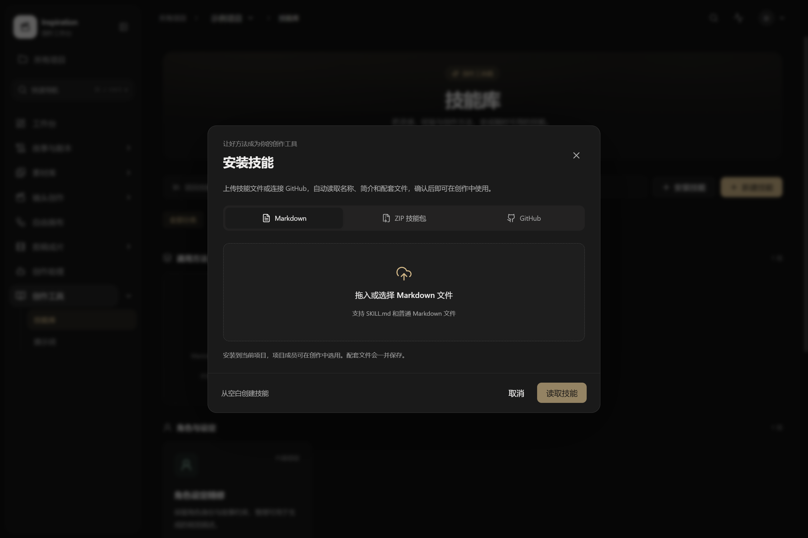
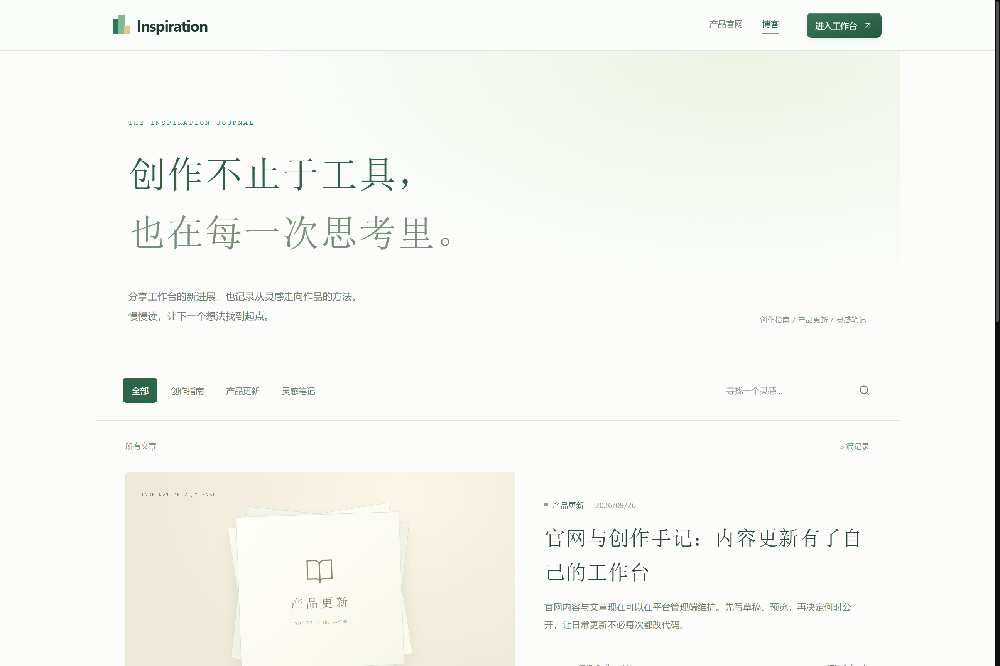

<p align="center">
  
</p>

# Inspiration

**让故事、素材与画面，在同一个创作现场连起来。**

面向短片、动漫和 AI 影视创作的 Web 工作台。从整理故事、积累参考，到探索画面、编排镜头和剪辑成片，让每一步创作都有上下文，每一份素材都能继续使用。

[界面预览](#界面预览) · [核心能力](#核心能力) · [快速开始](#快速开始) · [文档导航](docs/README.md) · [反馈与建议](https://github.com/Coinsi/inspiration/issues)


<p align="center"><sub>当前版本真实界面 · 深色创作工作区 · 截图中的灵感画面为界面示意，项目内容为演示数据</sub></p>

## 为持续创作而设计

一个镜头生成之后，创作通常才刚刚开始。你还需要找回参考、调整角色、比较版本，把满意的画面放回故事。

Inspiration 把这些事情组织在一起：

- **故事有连续的上下文。** 章节、设定、剧本与分镜相互衔接，修改有来源可查。
- **素材可以反复使用。** 角色、场景、图片和视频片段带着版本与引用关系进入创作。
- **AI 的建议可以审阅。** 创作助理调用项目工具、提出修改，由你决定是否应用。
- **作品可以继续演进。** 从画布探索到时间线编排，保留历史方案和成片基线。

## 界面预览

### 素材成为创作的起点

整理角色、场景与道具，保存参考图和生成版本；视频原片则通过素材库管理，按时间范围引用到创作。


<sub>截图展示演示项目已有参考素材，不代表所有画面均由本项目生成。点击图片可查看原尺寸。</sub>

<details>
<summary><strong>技能安装 · 把好方法留在项目里</strong></summary>

通过 Markdown、ZIP 技能包或 GitHub 安装创作方法，预览内容后加入项目，再交给创作助理使用。



</details>

<details>
<summary><strong>官网与博客 · 从产品介绍到内容更新</strong></summary>

浅色官网与深色创作工作区各有侧重。平台管理员可以维护官网、上传展示素材，以及编辑、预览和发布博客文章。



</details>

## 核心能力

| 创作环节 | 你可以做什么 |
| --- | --- |
| **故事与剧本** | 导入小说、管理章节与故事设定，编辑剧本、拆解场次和镜头，导出 Fountain |
| **素材与参考** | 管理角色、场景、道具和图片版本；上传大视频、整理目录、选择片段、追踪引用与恢复删除内容 |
| **自由画布** | 用节点连接文字、参考图和生成任务；拖线新增节点、绘图裁切、宫格拆分、依赖执行与离线打包 |
| **镜头与导演台** | 编排分镜、选择画面版本，安排场景机位、关键帧和运镜，衔接镜头生成 |
| **剪辑与交付** | 多画面轨、音轨与字幕编排，预览、导出、历史恢复，以及成片基线比较 |
| **Agent 与技能** | 项目内工具调用、修改审阅，技能包安装与复用；通过独立 MCP 网关连接外部 AI 工具 |
| **模型与任务** | 项目级渠道和模型配置，按文字、图片、视频能力选择，跟踪任务状态与生成来源 |
| **账户与协作** | 注册登录、个人资料、项目成员角色与权限；平台管理与项目管理分开 |
| **官网与博客** | 官网内容草稿、媒体上传、发布历史；文章分类、搜索、预览、发布与归档 |

视频语义检索与自动转写需要额外配置本地服务。功能入口和配置方式见[文档导航](docs/README.md)。

## 快速开始

### Windows 本地体验

准备 **Python 3.11+、Node.js 20+**；没有本地 PostgreSQL 等基础服务时，需要 Docker Desktop。克隆仓库后，双击根目录的 **`启动项目.bat`**，或运行：

```powershell
python start.py
```

启动器准备依赖、检查数据库迁移并复用已运行的服务。首次准备需要联网，完成后打开[本地首页](http://127.0.0.1:5173)。

### Docker Compose

```bash
git clone https://github.com/Coinsi/inspiration.git
cd inspiration/deploy
docker compose up --build -d
```

启动完成后访问 [http://127.0.0.1:5173](http://127.0.0.1:5173)。开发配置会初始化演示账号 **`demo / demo1234`**；现有账号和数据不会重置。新安装只提供账号和空示例项目，不预置截图中的素材与作品。

**第一次可以这样体验：** 登录 → 进入示例项目 → 导入[示例小说](samples/示例小说.txt) → 整理故事与剧本 → 在素材库和画布里探索画面。模型未配置时，可使用 Mock 策略了解任务与审阅流程。

[完整安装与排错](docs/GETTING_STARTED.md) · [后端开发](backend/README.md) · [前端开发](frontend/README.md)

## 当前进展与边界

项目持续开发中，适合本地体验、创作流程验证和二次开发。

- **真实模型接入仍需验收。** 已有 OpenAI Chat / Images / Videos 兼容协议及旧自定义网关适配；供应商实际可用性、生成质量和计费需逐一验证。Mock 结果用于流程演示。
- **素材检索与转写按需开启。** 分别依赖视觉索引服务与语音转写服务，不随基础启动自动下载模型；语义检索返回候选片段，转写结果需要校对。
- **声音创作与部分账号能力仍在后续计划。** 已有音轨和字幕编排；完整声音创作、邮件验证、邮件找回密码、具体第三方登录尚未接通。
- **面向公网部署需单独配置。** 替换开发密钥与默认凭据，配置供应商密钥加密、TLS、访问范围和备份。参见[部署与运行说明](docs/59-运行可靠性与部署修复.md)。

## 面向开发者

**React · TypeScript · FastAPI · PostgreSQL / pgvector · Redis / Celery · MinIO / 本地文件存储**

后端采用模块化单体与异步任务。数据库保存内容、版本和引用关系；大文件进入内容寻址存储。模型供应商通过适配器接入，生成任务保留当时的输入与产物来源。

| 目录 | 内容 |
| --- | --- |
| [`frontend/`](frontend/) | 官网、博客、创作工作台与管理页面 |
| [`backend/`](backend/) | 业务 API、权限、版本、存储、迁移与任务 |
| [`services/`](services/) | 视频索引、语音转写、MCP 网关 |
| [`deploy/`](deploy/) | Docker Compose 部署 |
| [`docs/`](docs/README.md) | 安装指南、功能说明、架构与阶段验收记录 |

[技术架构](docs/architecture/README.md) · [数据模型](docs/03-详细设计-数据模型.md) · [实现计划](docs/15-平台整体改造与交付计划.md)

欢迎通过 [Issues](https://github.com/Coinsi/inspiration/issues) 分享使用场景、界面建议和可复现的问题，也欢迎提交改进。反馈时附上操作步骤和预期结果，会更容易定位。

---

**把每一次尝试，留作下一次创作的起点。**
